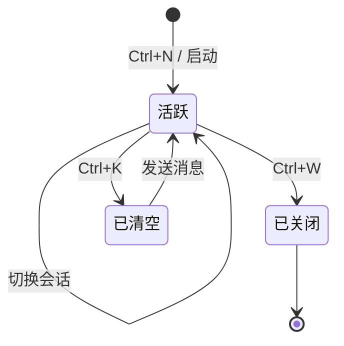

# XAgent TUI — 产品需求文档 (PRD)

> 版本: v0.2  
> 更新: 2025-07-17  
> 状态: Draft  
> 关联文档: [TUI_IMPLEMENTATION_PLAN.md](./TUI_IMPLEMENTATION_PLAN.md)

---

## 1. 产品定位

XAgent TUI 是一个基于 **mordant** 库构建的终端用户界面，作为 AI Agent 的交互客户端。参考 Claude Code、Codex CLI、OpenCode 等主流 Agent 终端应用，提供纯键盘驱动的完整 Agent 交互体验。

### 1.1 核心价值

- **纯终端体验**：无需浏览器/GUI，SSH 远程环境友好
- **键盘驱动**：Vim 风格快捷键，零鼠标依赖
- **流式实时**：逐 token 流式渲染，所见即所得
- **多会话**：同时管理多个独立 Agent 会话
- **轻量跨平台**：JVM 构建，Windows/macOS/Linux 全平台支持
- **协议标准化**：基于 ACP（Agent Client Protocol）协议通信

### 1.2 目标用户

- AI Agent 终端重度用户
- SSH 远程开发环境开发者
- CI/CD 流水线中交互式 Agent 操作
- 偏好纯键盘工作流的开发者

---

## 2. 界面布局

### 2.1 四分区 + 状态栏布局示意

```
┌──────────────────────────────────────────────────────────────┐
│ ┌───────────────────────┬────────────────────┐  │
│ │  对话消息流            │  信息面板           │  │
│ │  (ChatPanel, 65%)     │  (InfoPanel, 35%)  │  │
│ │                       │                    │  │
│ │ 👤 你  [14:30]         │ 📊 Token 用量      │  │
│ │  用户消息内容           │  Prompt: 1.2K     │  │
│ │ 🤖 AI  [14:31]         │  生成: 3.5K       │  │
│ │  **AI 回复内容**        │  总计: 4.7K       │  │
│ │  (Markdown 渲染)        │                    │  │
│ │ 🔧 工具  [14:31]       │ 📋 Todo           │  │
│ │  tool_name(...)… [Space]│  ● ✓ 任务A        │  │
│ │ 📎 结果  [14:31]       │  ● ◌ 任务B        │  │
│ │  工具执行结果            │                    │  │
│ │                       │ ℹ 信息             │  │
│ │ ↓ 更多消息 (PageDown)   │  模型: gpt-4      │  │
│ ├───────────────────────┴────────────────────┤ │
│ │ Input: > 输入指令...  [Enter 发送, Alt+Enter 换行] │
│ │        Ctrl+P 打开会话列表                     │
│ └──────────────────────────────────────────────┘ │
│ ● 已连接 │ 模型: gpt-4 │ 会话: 1/3 │ 14:30       │
└───────────────────────────────────────────────────┘
```

### 2.2 分区详解

#### 2.2.1 左侧 — 会话列表 (SidebarPanel)

| 功能 | 说明 | 优先级 |
|------|------|--------|
| 会话列表 | 显示所有会话，当前高亮（▸ 前缀） | P0 |
| 新建会话 | 底部显示快捷键提示 `[+] Ctrl+N` | P0 |
| 关闭会话 | 底部显示快捷键提示 `[×] Ctrl+W` | P0 |
| 会话名称 | 自动基于首条消息截取（最多20字） | P1 |
| 消息计数 | 每条会话旁显示消息数量 | P1 |
| 会话搜索 | Ctrl+F 聚焦搜索框过滤会话 | P2 |
| 拖拽排序 | 会话可调整顺序 | P3 |

#### 2.2.2 中间 — 对话消息流 (ChatPanel)

| 功能 | 说明 | 优先级 |
|------|------|--------|
| 消息时间线 | 按时间排列，角色区分（emoji + 颜色） | P0 |
| 流式渲染 | 实时追加 AI 回复内容，▌ 光标闪烁 | P0 |
| 消息角色 | USER/ASSISTANT/SYSTEM/TOOL_CALL/TOOL_RESULT/ERROR | P0 |
| Markdown | 标题/粗体/代码块/列表/引用/分隔线 | P1 |
| 滚动支持 | PageUp/PageDown/Home/End | P1 |
| 自动滚动 | 新消息自动滚到底部，手动滚动暂停 | P1 |
| 消息折叠 | 长工具结果可折叠/展开 | P2 |
| 消息时间戳 | 每条消息带时间戳显示 | P2 |
| 消息复制 | 选中消息 Ctrl+C 复制 | P2 |
| 代码块复制 | 代码块右上角显示复制按钮 | P3 |

**消息渲染规则：**

| 角色 | Emoji | 颜色 (TuiColors) | 前缀 |
|------|-------|-------------------|------|
| USER | 👤 | userMessage (brightBlue) | `👤 你` |
| ASSISTANT | 🤖 | assistantMessage (brightGreen) | `🤖 AI` |
| SYSTEM | ⚙ | systemMessage (brightYellow) | `⚙ 系统` |
| TOOL_CALL | 🔧 | toolMessage (brightMagenta) | `🔧 工具调用` |
| TOOL_RESULT | 📎 | 默认 | `📎 结果` |
| ERROR | ❌ | errorMessage (brightRed) | `❌ 错误` |

#### 2.2.3 右侧 — 信息面板 (InfoPanel)

| 区域 | 显示内容 | 优先级 |
|------|----------|--------|
| Token 用量 | Prompt/Completion/Total + 费用(USD) | P0 |
| Todo 列表 | Agent 发出的 todo 项状态追踪 | P0 |
| 模型信息 | 当前模型名称、Agent 名称/版本 | P1 |
| 上下文占用 | 当前上下文窗口百分比 | P2 |
| 会话模式 | 当前会话模式 (normal/ask/edit/architect) | P2 |

**Todo 状态图标：**

| 状态 | 图标 | 说明 |
|------|------|------|
| PENDING | ○ | 待办 |
| IN_PROGRESS | ◌ | 进行中 |
| COMPLETED | ✓ | 已完成 |
| FAILED | ✗ | 失败 |
| SKIPPED | — | 跳过 |

#### 2.2.4 底部 — 输入面板 (InputPanel)

| 功能 | 说明 | 优先级 |
|------|------|--------|
| 单行输入 | 基础文本输入 | P0 |
| 多行输入 | Enter 换行，Ctrl+Enter 发送 | P1 |
| 占位符 | 空输入时显示提示文字 | P1 |
| 输入历史 | ↑/↓ 导航历史输入 | P1 |
| Emacs 快捷键 | Ctrl+A/E/F/B 光标移动 | P2 |
| 输入计数 | 右下角显示字符数 | P2 |
| 粘贴支持 | Ctrl+V / Shift+Insert | P2 |

#### 2.2.5 底部 — 状态栏 (StatusBar)

| 字段 | 格式 | 优先级 |
|------|------|--------|
| Agent 名称 | `XAgent v0.1` | P0 |
| 连接状态 | `● 已连接` / `◌ 连接中` / `○ 断开` / `◌ 重连中` / `✕ 错误` | P0 |
| 当前模型 | `模型: gpt-4` | P1 |
| 会话计数 | `会话: 3/5` | P1 |
| 当前时间 | `14:30` | P1 |

---

## 3. 快捷键系统

### 3.1 完整快捷键映射

| 快捷键 | Action | 功能 | 优先级 |
|--------|--------|------|--------|
| `Ctrl+Enter` | SEND_MESSAGE | 发送消息 | P0 |
| `Ctrl+C` | CANCEL_OR_INTERRUPT | 中断当前响应 | P0 |
| `Ctrl+N` | NEW_SESSION | 新建会话 | P0 |
| `Ctrl+W` | CLOSE_SESSION | 关闭当前会话 | P0 |
| `Ctrl+Q` | QUIT_APP | 退出应用 | P0 |
| `Ctrl+P` | COMMAND_PALETTE | 命令面板 | P1 |
| `Ctrl+K` | CLEAR_CONVERSATION | 清空当前对话 | P1 |
| `Ctrl+D` | TOGGLE_THEME | 切换主题 | P2 |
| `Tab` | FOCUS_NEXT | 焦点下一个面板 | P1 |
| `Shift+Tab` | FOCUS_PREVIOUS | 焦点上一个面板 | P1 |
| `↑` | INPUT_HISTORY_PREV | 输入历史上一条 | P0 |
| `↓` | INPUT_HISTORY_NEXT | 输入历史下一条 | P0 |
| `PageUp` | SCROLL_PAGE_UP | 消息流上翻页 | P1 |
| `PageDown` | SCROLL_PAGE_DOWN | 消息流下翻页 | P1 |
| `Home` | SCROLL_TOP | 滚动到顶部 | P1 |
| `End` | SCROLL_BOTTOM | 滚动到底部 | P1 |
| `Ctrl+R` | REGENERATE | 重新生成 | P2 |
| `Ctrl+S` | TOGGLE_SIDEBAR | 切换侧栏显示 | P2 |
| `Ctrl+L` | CLEAR_SCREEN | 清屏 | P2 |

### 3.2 Emacs 编辑键（输入模式）

| 快捷键 | 功能 | 优先级 |
|--------|------|--------|
| `Ctrl+A` | 光标移动到行首 | P2 |
| `Ctrl+E` | 光标移动到行尾 | P2 |
| `Ctrl+F` | 光标向右移动 | P2 |
| `Ctrl+B` | 光标向左移动 | P2 |
| `Ctrl+U` | 删除到行首 | P2 |

> **阶段一限制**：仅支持基础输入（字符、退格、↑/↓ 历史导航），多行/Eamcs 快捷键在阶段二实现
| `Ctrl+K` | 删除到行尾 | P2 |

---

## 4. 会话管理

### 4.1 会话生命周期



### 4.2 会话特性

| 特性 | 说明 | 优先级 |
|------|------|--------|
| 默认会话 | 启动时自动创建第一个会话 | P0 |
| 自动命名 | 基于首条用户消息截取（最长20字符） | P1 |
| 会话上限 | 默认最多50个会话 | P1 |
| 会话持久化 | 保存到 `~/.xagent/sessions/` JSON 文件，仅用于启动恢复和展示 | P2 |
| 会话搜索 | 按名称过滤会话列表 | P2 |
| 会话导出 | 导出为 Markdown/JSON | P3 |

---

## 5. ACP 协议集成

### 5.1 通信架构

```
┌──────────────────────┐       ACP (Stdio/WebSocket)      ┌──────────────────┐
│   XAgent TUI (Client)  │ ◄─────────────────────────────► │  Agent 子进程    │
│                        │  JSON-RPC over NDJSON           │  (ACP Server)    │
│  ┌──────────────────┐  │                                  │                  │
│  │ ACP SDK Client    │  │                                  │  ProcessBuilder  │
│  │ Session.prompt()  │  │                                  │  or WebSocket    │
│  └──────────────────┘  │                                  └──────────────────┘
└──────────────────────┘
```

### 5.2 握手流程

```
TUI Client                              Agent
    │                                       │
    │─── initialize(clientInfo) ──────────►│
    │◄─── AgentInfo (capabilities) ────────│
    │                                       │
    │─── session/new(cwd) ────────────────►│
    │◄─── sessionId + AgentSession ────────│
    │                                       │
    │─── session/prompt(content) ─────────►│
    │◄─── [streaming events] ──────────────│ (逐帧推送)
    │◄─── session/update(notification) ────│ (异步通知)
    │                                       │
    │─── session/cancel ──────────────────►│ (中断)
    │◄─── cancelled ──────────────────────│
```

### 5.3 事件类型与处理

| ACP 事件 | TUI 处理 | 优先级 |
|----------|----------|--------|
| `text` delta | `appendStreamingContent()` 追加 | P0 |
| `done` | `finishStreaming()` 标记完成 | P0 |
| `error` | `errorMessage` 显示 + finishStreaming | P0 |
| `todo` / `todo_status` | InfoPanel Todo 列表更新 | P1 |
| `token` | InfoPanel Token 统计更新 | P1 |
| `agent` | 状态栏 Agent 信息更新 | P1 |
| `model` | 状态栏模型名更新 | P1 |
| `tool_call` / `tool_result` | ChatPanel 工具调用卡片 | P1 |
| `thought` | 思考过程折叠显示 | P2 |

### 5.4 传输方式

| 方式 | 支持 | 说明 |
|------|------|------|
| Stdio (ProcessBuilder) | ✅ P0 | 阶段一唯一支持，TUI 启动时自动启动子进程 |
| WebSocket (远程连接) | ❌ 预留 | 扩展点，阶段三实现 |

### 5.5 认证机制

| 场景 | 处理方式 |
|------|----------|
| ACP initialize 返回需要认证 | 输入框显示 `[需要认证，按回车继续]` 提示，用户回车后调用 `client.authenticate()` |
| OAuth/API Key 完整流程 | 阶段三扩展，预留 `AuthenticationHandler` 接口 |

### 5.6 子进程生命周期

| 阶段 | 操作 | 状态变化 |
|------|------|----------|
| TUI 启动 | ProcessBuilder 启动 Agent | DISCONNECTED → CONNECTING |
| 进程就绪 | initialize + newSession | CONNECTING → CONNECTED |
| 进程退出 | 检测 exitValue | CONNECTED → DISCONNECTED |
| 异常退出 | 错误提示 + 自动重连 | CONNECTED → RECONNECTING → CONNECTED |

---

## 6. 用户工作流

### 6.1 基础对话流

```
1. 启动 TUI
2. 自动连接 Agent（状态栏显示连接进度）
3. 在输入框输入消息
4. Ctrl+Enter 发送
5. Agent 流式回复（ChatPanel 逐 token 渲染）
6. 输入下一条消息继续对话
```

### 6.2 多会话工作流

```
1. Ctrl+N 新建会话
2. 侧栏出现新会话条目
3. 在新会话中输入不同上下文的消息
4. Tab 键切换到侧栏
5. ↑/↓ 选择其他会话
6. 会话间独立上下文互不干扰
```

### 6.3 中断与重试

```
1. Agent 正在生成回复
2. 发现回答方向不对
3. Ctrl+C 中断当前生成
4. 修改输入框内容
5. Ctrl+Enter 重新发送
```

### 6.4 查看工具调用

```
1. Agent 执行工具调用时
2. ChatPanel 显示 🔧 工具调用卡片
3. 显示工具名称、参数
4. 工具完成后显示 📎 结果
5. 长结果可折叠查看
```

---

## 7. 技术架构

### 7.1 模块划分

```
com.xr21.ai.agent.tui/
├── Main.kt                  # 入口 + CLI 参数解析
├── TuiApp.kt                # 应用生命周期 + 事件调度 + 渲染循环
├── config/
│   └── TuiConfig.kt         # 布局比例、颜色、Agent 命令等配置
├── state/
│   └── AppState.kt          # 全局状态管理（会话/消息/Todo/Token）
├── acp/
│   ├── ConnectionState.kt   # 连接状态枚举（5种）
│   ├── AcpClientManager.kt  # ACP 客户端管理（子进程 + Stdio 通信）
│   └── AcpEventProcessor.kt # ACP 事件解析与状态更新
├── event/
│   ├── KeyBinding.kt        # 快捷键映射表
│   ├── InputHandler.kt      # RawMode 键盘输入解析
│   └── EventLoop.kt         # 主事件循环
├── layout/
│   ├── MainLayout.kt        # 布局入口
│   ├── AppLayout.kt         # 四分区 table 布局
│   ├── SidebarPanel.kt      # 会话列表面板
│   ├── ChatPanel.kt         # 对话消息面板
│   ├── InfoPanel.kt         # 信息面板（Token/Todo）
│   ├── InputPanel.kt        # 输入框面板
│   ├── SessionListPopup.kt  # 会话列表弹窗
│   └── StatusBar.kt         # 状态栏
├── theme/
│   └── TuiTheme.kt         # 主题定义（颜色方案）
└── util/
    └── StringUtils.kt       # 字符串工具类
```

### 7.2 数据流

```
┌──────────┐    KeyEvent    ┌──────────┐   Action   ┌───────────┐
│ 终端输入   │ ────────────► │ 事件循环   │ ──────────► │ 状态更新   │
└──────────┘               └──────────┘             └─────┬─────┘
                                                          │
                                                          ▼
┌──────────┐    Flow<Event> ┌──────────┐              ┌───────────┐
│ ACP 客户端 │ ────────────► │ 事件处理   │ ────────────► │ 全量重绘   │
└──────────┘               └──────────┘              └───────────┘
                                                          │
                                                          ▼
                                                    ┌───────────┐
                                                    │ 终端渲染   │
                                                    │ cursor(0,0)│
                                                    └───────────┘
```

### 7.3 渲染策略

- **全量重绘**：每次状态变更后调用 `terminal.cursor.move(0,0)` + `println(rendered)`
- **触发时机**：键盘事件、ACP 事件、定时器（状态栏时间）
- **性能**：mordant table DSL 性能足够支持 30fps 全量重绘
- **防闪烁**：光标先移回左上角再绘制

### 7.4 状态管理

`AppState` 单一全局状态对象：
- **可变对象模式**：直接修改属性
- **单线程模型**：所有状态修改在事件循环线程进行
- **无状态快照**：每次渲染直接从 AppState 读取最新值
- **线程安全**：协程事件循环保证顺序访问

### 7.5 焦点管理

| 面板 | 焦点效果 | 切换方式 |
|------|----------|----------|
| LEFT (会话列表) | 边框 activeBorder 高亮 | Tab |
| CENTER (对话流) | 边框 activeBorder 高亮 | Tab |
| RIGHT (信息面板) | 边框 activeBorder 高亮 | Tab |
| INPUT (输入框) | 光标可见 → 键盘输入 | Tab |

焦点切换由 `AppState.focusedPanel` 管理，`Tab`/`Shift+Tab` 循环切换四个面板。

---

## 8. 非功能需求

### 8.1 性能指标

| 指标 | 目标 | 备注 |
|------|------|------|
| 启动时间 | < 2秒 | JVM 冷启动 + Agent 连接 |
| 帧率 | > 30fps | 全量重绘不卡顿 |
| 内存占用 | < 256MB | JVM 堆内存 |
| 消息上限 | 500+ 条/会话 | 超出截断或分页 |
| 会话上限 | 50 个 | 超出提示 |
| 输入历史 | 100 条 | 循环覆盖 |

### 8.2 兼容性

| 平台 | 支持 | 说明 |
|------|------|------|
| Windows 10/11 | ✅ | 优先检测 Windows Terminal |
| macOS 12+ | ✅ | Terminal.app / iTerm2 |
| Linux | ✅ | 主流发行版 |
| 最小终端 | 80×24 | 低于此显示提示 |
| tmux/screen | ✅ | 支持嵌套终端 |

### 8.3 质量属性

- **可用性**：全键盘操作，零鼠标依赖
- **可恢复性**：Agent 进程崩溃后自动重连
- **可观测性**：状态栏实时显示连接状态
- **可扩展性**：Action 模式支持新增操作
- **可配置性**：TuiConfig 集中管理所有可调参数

---

## 9. 实施路线图

### 阶段一：核心框架 + ACP 基础通信（MVP）

> **目标**: 可用的最小闭环 TUI —— 启动 → 输入 → Agent 回复 → 显示  
> **时间**: 当前

| 模块 | 关键交付 | 依赖 |
|------|----------|------|
| 依赖配置 | mordant + ACP SDK 依赖就绪 | — |
| 配置与 CLI | TuiConfig + 参数解析 | — |
| ACP 客户端 | StdioTransport + 子进程管理 | 1.1 |
| ACP 握手 | initialize + newSession | 1.3 |
| 状态管理 | AppState 完整实现 | — |
| Terminal 初始化 | RawMode + 生命周期 | — |
| 四分区布局 | table DSL 布局 + 5个面板骨架 | 1.2 |
| 事件循环 | KeyEvent → Action → Handler | 1.5 |
| 输入面板 | RawMode 键盘输入 + 基础编辑 | 1.8 |
| ACP 事件处理 | 8种事件解析 → AppState 更新 | 1.4 |
| ChatPanel | 消息流渲染 + 角色区分 | 1.7 |
| 状态栏 | 连接状态 + 模型 + 时间 | 1.7 |
| 集成联调 | 全链路串联测试 | 全部 |

### 阶段二：交互完善

| 功能 | 说明 | 优先级 |
|------|------|--------|
| 流式打字机效果 | 逐 token 渲染 + 光标闪烁 | P0 |
| Markdown 渲染 | mordant-markdown 集成 | P1 |
| 工具调用可视化 | 展开/折叠工具调用卡片 | P1 |
| 会话列表交互 | 新建/切换/删除完整逻辑 | P1 |
| 输入历史 UI | ↑/↓ 导航历史消息 | P1 |
| Todo 实时更新 | InfoPanel Todo 对接 ACP | P1 |
| Token 统计 | InfoPanel Token 用量动态更新 | P1 |
| 焦点切换 | Tab/Shift+Tab 面板切换高亮 | P1 |

### 阶段三：高级功能

| 功能 | 说明 | 优先级 |
|------|------|--------|
| 命令面板 | Ctrl+P 模糊搜索命令 | P2 |
| 主题切换 | 暗色/亮色一键切换 | P2 |
| 会话持久化 | 本地 JSON 文件存储 | P2 |
| 输入增强 | Emacs 编辑键 + 多行 | P2 |
| WebSocket 传输 | 远程 Agent 连接 | P2 |
| 自定义快捷键 | 可配置键绑定 | P3 |

### 阶段四：优化与发布

| 功能 | 说明 | 优先级 |
|------|------|--------|
| Windows Terminal 检测 | 自动检测推荐 Terminal | P2 |
| 错误处理与重连 | 崩溃检测 + 自动重连 | P2 |
| 性能优化 | 帧率/内存优化 | P2 |
| GraalVM 原生镜像 | 编译为原生可执行文件 | P3 |
| 用户文档 | 使用指南 + 配置说明 | P2 |
| 发布与分发 | Maven Central + GitHub Release | P3 |

---

## 10. 竞争分析

| 特性 | Claude Code | Codex CLI | OpenCode | **XAgent TUI** |
|------|:-----------:|:---------:|:--------:|:--------------:|
| 终端原生 | ✅ | ✅ | ✅ | ✅ |
| 多会话 | ✅ | ❌ | ✅ | ✅ |
| 流式输出 | ✅ | ✅ | ✅ | ✅ |
| Markdown | ✅ | ✅ | ✅ | ✅ |
| 工具调用可视化 | ✅ | ✅ | ✅ | ✅ |
| Todo 追踪 | ✅ | ❌ | ❌ | ✅ |
| 跨平台 | ✅ | ✅ | ❌ | ✅ |
| 开源 | ❌ | ✅ | ✅ | ✅ |
| ACP 协议 | ✅ | ❌ | ❌ | ✅ |
| 命令面板 | ✅ | ❌ | ❌ | ✅ |
| 主题切换 | ✅ | ❌ | ❌ | ✅ |
| 会话持久化 | ✅ | ❌ | ❌ | ✅ |

---

## 11. 附录

### 11.1 技术栈

| 组件 | 技术 | 版本 |
|------|------|------|
| 语言 | Kotlin | 17 |
| TUI 框架 | mordant | 3.0.2 |
| 通信协议 | ACP (Agent Client Protocol) | 0.23.0 |
| 构建工具 | Gradle + Kotlin DSL | — |
| 原生支持 | GraalVM Native Image | — |

### 11.2 参考项目

- [Claude Code](https://docs.anthropic.com/en/docs/claude-code) — Anthropic 终端 Agent
- [Codex CLI](https://github.com/openai/codex) — OpenAI 终端 Agent
- [OpenCode](https://github.com/sst/opencode) — SST 开源终端 Agent
- [Continue](https://github.com/continuedev/continue) — 开源 AI 编程助手

### 11.3 术语表

| 术语 | 说明 |
|------|------|
| TUI | Terminal User Interface，终端用户界面 |
| ACP | Agent Client Protocol，Agent 客户端协议 |
| RawMode | 终端原始模式，逐字符读取不经过行缓冲 |
| Session | 会话，独立对话上下文 |
| Streaming | 流式输出，逐 token 实时渲染 |
| Panel | 面板，布局中的功能分区 |
| NDJSON | Newline Delimited JSON，换行分隔 JSON |
| Flow | Kotlin 协程 Flow，事件流 |
| Widget | mordant 组件，如 Panel、Text、Table |